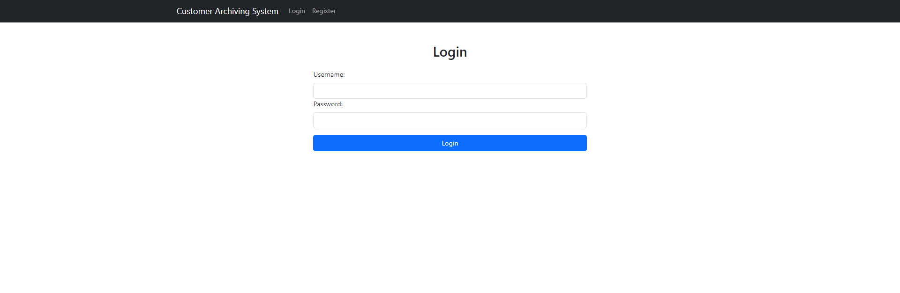
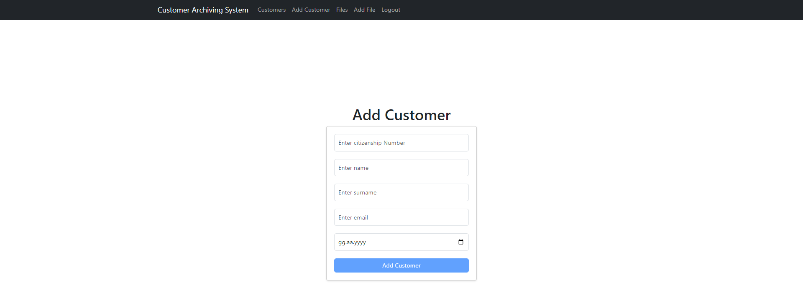

# JWT Tabanlı Müşteri Arşivleme Sistemi UI

Bu uygulaman amacı tam yetkili bir kullanıcının, belirli rollerle korunan API endpointlerine erişerek müşteri ve dosya yönetimini sağlamaktır. Backend (Spring Boot) uygulaması ile birlikte çalışmaktadır.

#### Backend (Spring Boot) uygulaması için: [JWT Based Customer Archiving System - Backend](https://github.com/bilalmuzafferkose/spring-customer-archiving-system)

## Başlangıç

Projeyi başlatmak ve yerel makinenizde çalıştırmak için aşağıdaki adımları takip edin.

### Gereksinimler

Aşağıdaki yazılımların yüklü olduğundan emin olun:
- NPM

### Kullanılan Teknolojiler
- React
- Bootstrap
- Axios

### Kurulum

1. Repository'yi klonlayın:
   ```bash
   git clone https://github.com/bilalmuzafferkose/spring-customer-archiving-system-ui
   ```
2. Proje dizinine gidin:
    ```bash
    cd spring-customer-archiving-system
    ```
3. React uygulamasını başlatın:
    ```bash
    npm run dev
    ```

## Kullanım

Aşağıda sistemin UI kısımlarından örnekler gösterilmiştir.







